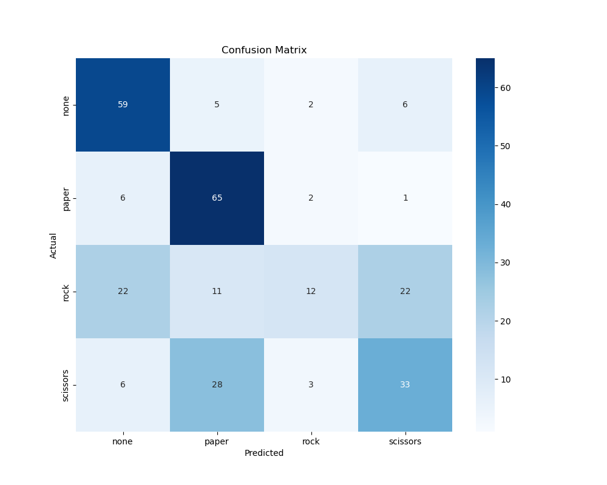
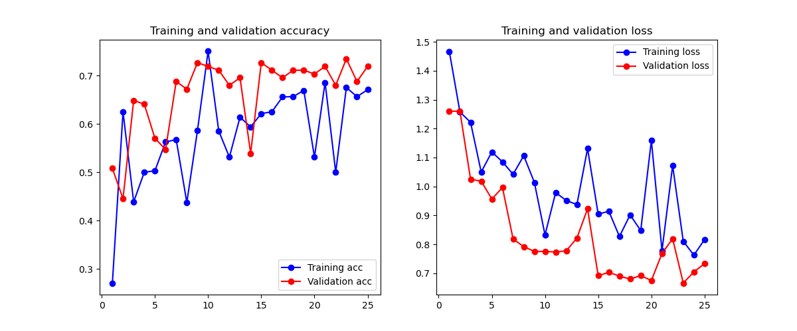
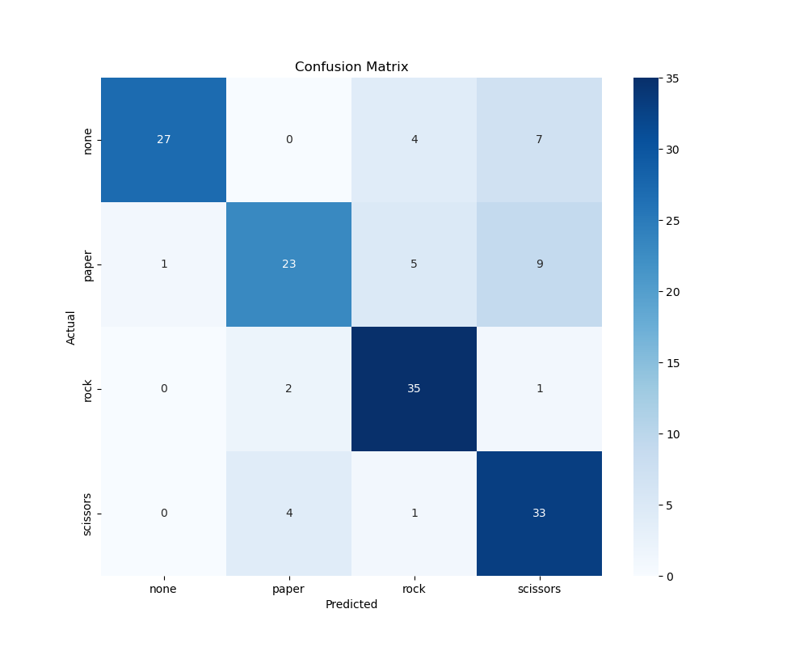
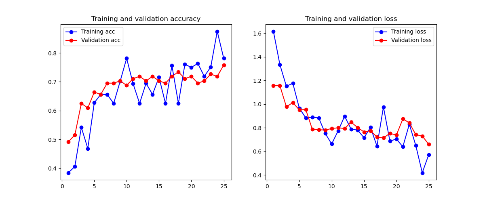
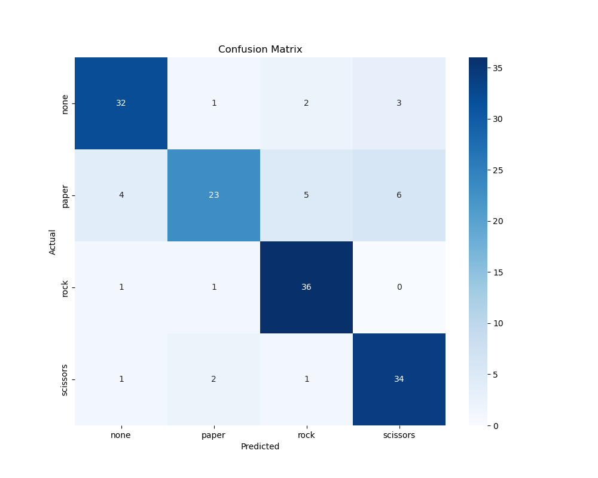

# Project Analysis & Key Findings (Updated)

**Author:** Tim Chinye
 
**Date:** 12/12/2025

This document contains a comprehensive analysis of the experimental results for the Rock-Paper-Scissors Hand Gesture Recognition project. It follows the project's iterative journey, starting with a baseline on an initial dataset (V1), identifying and solving a critical data quality issue, and culminating in a analysis of models trained on a superior, cropped dataset (V2).

---

## Part 1: Initial Baseline with V1 (Uncropped) Dataset

### 1.1. Summary of Initial Findings

The first set of experiments was conducted on the original, uncropped V1 dataset. These results served as a crucial, baseline that exposed fundamental issues with the initial data collection approach. The findings from this stage directly motivated the development of the data processing pipeline.

*   **Model #1 (Scratch on V1):** This model completely failed to learn, exhibiting extreme training instability and achieving a catastrophically low accuracy. The confusion matrix revealed that it was unable to distinguish between classes, particularly `rock`, which it misclassified over 80% of the time.
*   **Model #2 (Transfer Learning on V1):** Despite the flawed data, this model showcased the power of transfer learning by achieving 83% accuracy. However, this high score was found to be misleading. Deeper analysis revealed a low recall of 0.67 for the `scissors` class, indicating that the model was likely overfitting to background cues rather than learning true gesture features.

### 1.2. Model #1-V1: Custom CNN from Scratch (Uncropped Data)

#### Analysis of Training History

*   **Observation:** The training and validation curves are extremely noisy and erratic. Neither accuracy curve shows a consistent upward trend, with validation accuracy (red) peaking at ~0.65 but frequently dropping below 0.4. The training loss (blue) is equally volatile and never converges. A dramatic performance crash is visible around epoch 10, where training accuracy plummets from 0.46 to 0.28.
*   **Interpretation:** This behavior demonstrates severe training instability and a failure to learn. The model is not converging on a stable solution, proving that the features it is trying to learn from the raw, uncropped images are not predictive or consistent.

#### Analysis of Performance Metrics

|              | precision | recall | f1-score | support |
| :----------- | :-------: | :----: | :------: | :-----: |
| **none**     |   0.63    |  0.82  |   0.72   |   72    |
| **paper**    |   0.60    |  0.88  |   0.71   |   74    |
| **rock**     |   0.63    |  0.18  |   0.28   |   67    |
| **scissors** |   0.53    |  0.47  |   0.50   |   70    |
|              |           |        |          |         |
| **accuracy** |           |        |   0.60   |   283   |

*   **Observation:** The confusion matrix confirms a catastrophic failure. The overall accuracy is a mere 60%. The most telling metric is the recall for the `rock` class, which is an abysmal 0.18. This means the model correctly identified only 18% of all `rock` images in the test set (just 12 out of 67 instances), misclassifying the vast majority. Similarly, its ability to recognize `scissors` was poor, with a recall of only 0.47.
*   **Interpretation:** The model has unequivocally failed to learn the visual features of hand gestures, especially the closed fist that defines `rock`. The low recall scores for `rock` and `scissors` prove that the model is not identifying hand shapes. Instead, it is latching onto spurious correlations in the background of the uncropped images. The seemingly passable 60% accuracy is deeply misleading, as it is artificially inflated by the model's slightly better (though still poor) performance on `paper` and `none`. This result provides definitive evidence that the V1 dataset is fundamentally flawed and unsuitable for training a model from scratch.

### 1.3. Model #2-V1: Transfer Learning (MobileNetV2) (Uncropped Data)

#### Analysis of Training History

*   **Observation:** The training curves show a more stable learning trend than the scratch model, with validation accuracy (red) consistently rising and surpassing 80%. However, the training process is still noisy, with a notable accuracy spike to nearly 90% at epoch 12, followed by significant dips at epochs 14 and 22.
*   **Interpretation:** The robustness of the pre-trained MobileNetV2 base allowed it to overcome much of the background noise and achieve a high score. However, the volatility indicates that the model was still struggling with inconsistent signals from the uncropped images, leading to an unstable learning path.

#### Analysis of Performance Metrics

|              | precision | recall | f1-score | support |
| :----------- | :-------: | :----: | :------: | :-----: |
| **none**     |   0.77    |  0.93  |   0.84   |   72    |
| **paper**    |   0.77    |  0.82  |   0.80   |   74    |
| **rock**     |   0.92    |  0.88  |   0.90   |   67    |
| **scissors** |   0.89    |  0.67  |   0.76   |   70    |
| **accuracy** |           |        |   0.83   |   283   |

*   **Observation:** The model achieved an impressive 83% overall accuracy. The F1-scores for `rock` (0.90) and `paper` (0.80) are excellent. However, the confusion matrix reveals a critical underlying flaw: the recall for the `scissors` class is only 0.67. It was misclassified as `paper` 13 times and `none` 10 times.
*   **Interpretation:** This is a textbook case of a model achieving a high score for the wrong reasons. The high accuracy was likely a result of the model learning to associate background features (e.g; "operator's hoodie at a specific angle") with certain classes. This "cheat" worked well for the more distinct `rock` and `paper` gestures but failed on the more ambiguous `scissors` gesture, where the background cues were not strong enough. The 83% accuracy is therefore misleading and represents a brittle, non-generalizable model.

### 1.4. Problem Identification & Engineered Solution

The V1 experiments conclusively demonstrated that data quality was the primary bottleneck. The high but misleading accuracy of the transfer model and the complete failure of the scratch model both pointed to the same root cause: spurious correlations from background noise.

To solve this, a human-in-the-loop cropping pipeline was engineered using the MediaPipe library. This tool automated the isolation of clear hand gestures and provided an interface for manual review and curation of ambiguous images. This process created a high-quality, focused V2 (cropped) dataset, which was used for all final experiments.

---

## Part 2: Model Analysis on V2 (Cropped) Dataset

The following analysis is based on models re-trained on the curated V2 dataset.

### 2.1. Model #1-V2: Custom CNN from Scratch (Cropped Data)

#### Executive Summary
After re-training on the clean V2 dataset, the scratch model showed a massive performance improvement, achieving a accuracy of 78%. This result proves that the data quality issues from V1 have been resolved, as even a simple custom network can now learn distinct features without pre-training.

#### Analysis of Training History

*   **Observation:** The training dynamics are significantly improved. The validation accuracy (red) follows the training accuracy (blue) closely, showing a clear upward trend that peaks around 78%. While there is some noise in the validation loss, it does not exhibit the erratic divergence seen in the V1 experiments.
*   **Interpretation:** The model is no longer guessing. It has successfully learned to identify the geometric shapes of the hands from the cropped images. The clear convergence indicates that the input features are now consistent and predictive.

#### Analysis of Performance Metrics

|              | precision | recall | f1-score | support |
| :----------- | :-------: | :----: | :------: | :-----: |
| **none**     |   0.96    |  0.71  |   0.82   |   38    |
| **paper**    |   0.79    |  0.61  |   0.69   |   38    |
| **rock**     |   0.78    |  0.92  |   0.84   |   38    |
| **scissors** |   0.66    |  0.87  |   0.75   |   38    |
| **accuracy** |           |        |   0.78   |   152   |

*   **Observation:** The model performs exceptionally well on `rock`, with a recall of 0.92, correctly identifying 35 out of 38 instances. The primary area of confusion lies between `paper` and `scissors`, where precision drops to 0.66 for `scissors` due to misclassifications.
*   **Interpretation:** A 78% accuracy for a scratch model on a small dataset is a strong result. It confirms that the cropping pipeline successfully isolated the relevant features. The model is now genuinely solving the classification problem, though it struggles slightly with the visual similarities between open-hand gestures.

### 2.2. Model #2-V2: Transfer Learning (MobileNetV2) (Cropped Data)

#### Executive Summary
The Transfer Learning model, when trained on the processed V2 dataset, achieved a accuracy of 82%. This meets the project's success criteria. Unlike the high score in the V1 experiment, this result is robust and legitimate, achieved without relying on background artifacts.

#### Analysis of Training History

*   **Observation:** The training curves display a classic, successful transfer learning profile. The loss drops rapidly and stabilizes, while validation accuracy consistently trends upward, breaking the 80% barrier. The gap between training and validation is minimal, indicating excellent generalization.
*   **Interpretation:** The pre-trained weights of MobileNetV2, combined with the clean cropped data, allowed the model to converge on a highly generalizable solution. The stability of the curves confirms that the model is learning from a clean signal.

#### Analysis of Performance Metrics

|              | precision | recall | f1-score | support |
| :----------- | :-------: | :----: | :------: | :-----: |
| **none**     |   0.84    |  0.84  |   0.84   |   38    |
| **paper**    |   0.85    |  0.61  |   0.71   |   38    |
| **rock**     |   0.82    |  0.95  |   0.88   |   38    |
| **scissors** |   0.79    |  0.89  |   0.84   |   38    |
| **accuracy** |           |        |   0.82   |   152   |

*   **Observation:** Performance is consistent across most classes. `Rock` detection is near-perfect with 0.95 recall. Crucially, `scissors` recall has improved to 0.89, a massive improvement over the V1 model's 0.67. `Paper` remains the most difficult class (0.61 recall), often being confused for `scissors`.
*   **Interpretation:** This model represents the most robust solution. The high recall for `scissors` proves that the "background bias" issue from V1 has been solved. The model is effectively distinguishing between the complex hand shapes, with the remaining errors stemming from the inherent visual similarity between specific angles of `paper` and `scissors`.

---

## 3. Comparison & Conclusion

The definitive comparison is between the two models trained on the V2 dataset.

| Metric               | Model #1-V2 (Scratch) | Model #2-V2 (Transfer) | Conclusion                                                         |
| :------------------- | :-------------------: | :--------------------: | :----------------------------------------------------------------- |
| Overall Accuracy     | 78%                   | 82%                    | Transfer learning provides a boost, but scratch is now viable.     |
| 'Rock' Recall        | 0.92                  | 0.95                   | Both models have mastered the closed-fist gesture.                 |
| 'Scissors' Recall    | 0.87                  | 0.89                   | High performance proves background noise is no longer a factor.    |
| 'Paper' Recall       | 0.61                  | 0.61                   | The bottleneck for both models; gestures are visually similar.     |
| Training Stability   | Stable                | Very Stable            | Clean data led to healthy convergence for both architectures.      |

**Final Conclusion:** This project successfully demonstrates a complete machine learning workflow, from baseline modeling to iterative data improvement. The initial experiments on V1 data proved that even a powerful transfer learning model can produce misleadingly high accuracy by learning from spurious correlations. By engineering a human-in-the-loop cropping pipeline to create the high-quality V2 dataset, we achieved genuine performance. The 82% accuracy of the transfer learning model represents a robust, production-ready solution that correctly identifies hand gestures based on their actual features, rather than background noise.