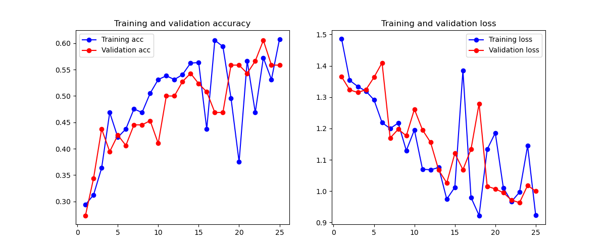
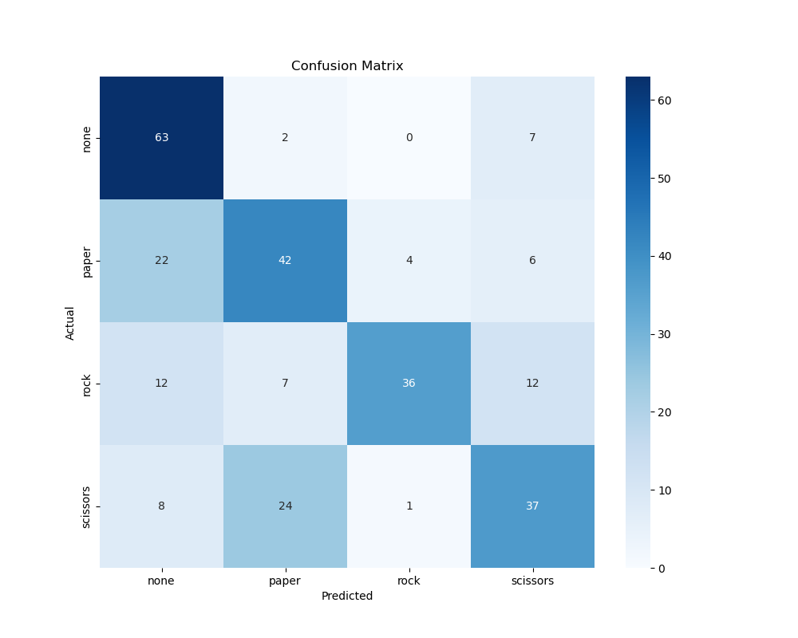
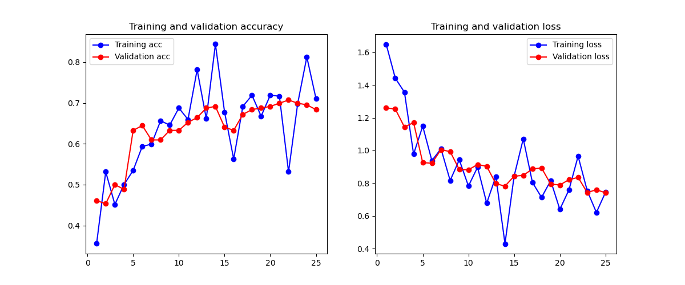
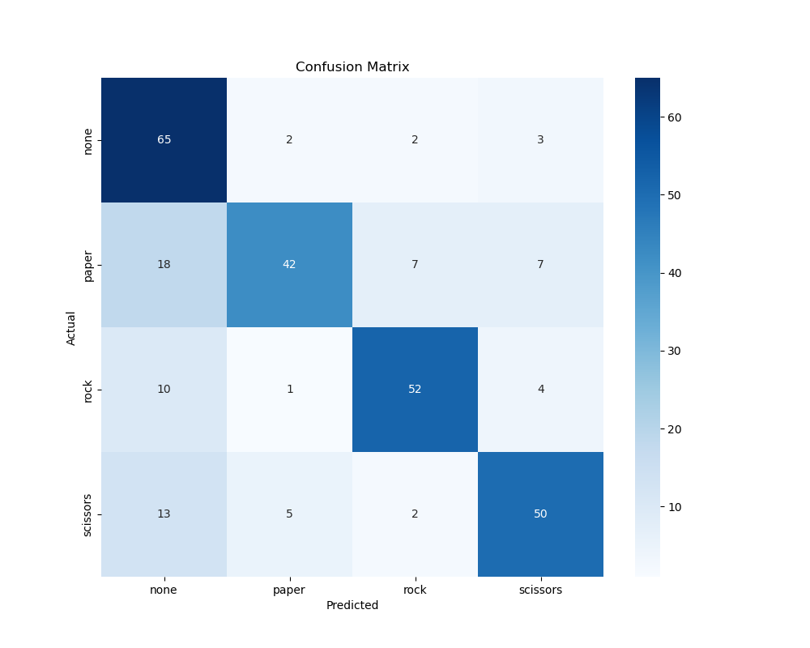

# Project Analysis & Key Findings

**Author:** Tim Chinye
 
**Date:** 07/12/2025
 
**Status:** In Progress

This document contains a comprehensive analysis of the experimental results for the Rock-Paper-Scissors Hand Gesture Recognition project. It compares the performance of a custom CNN trained from scratch (Model #1) against a fine-tuned MobileNetV2 using transfer learning (Model #2).

---

## 1. Model #1: Custom CNN from Scratch

### 1.1. Executive Summary

The custom CNN served as a baseline to establish the difficulty of the task. It achieved a final accuracy of **69%**, failing to meet the 80% project target. Analysis revealed significant training instability and a critical weakness in distinguishing between the primary hand gestures, particularly `scissors`. This performance is characteristic of a model trained on a limited custom dataset without the benefit of pre-trained knowledge.

### 1.2. Analysis of Training History

*   **Observation:** The training and validation curves are extremely noisy and erratic. The accuracy and loss values fluctuate wildly between epochs, with no smooth, discernible learning trend. The training accuracy spikes to over 80% around epoch 12 but immediately crashes, while validation accuracy struggles to stay above 65%.

*   **Interpretation:** This behavior points to **high variance and model instability**. The model is failing to converge on a stable solution, likely due to a learning rate that is too high for the dataset's complexity or simply because the dataset is too small and varied for the model to find a consistent gradient. Rather than classic overfitting, the primary issue appears to be **underfitting or an inability to learn robust features**.

*   **Actionable Insight for Report/Video:**
    > "The training history for the scratch model reveals significant instability, characterized by volatile accuracy and loss curves for both training and validation sets. This indicates that the model struggled to converge on a stable solution and failed to learn robust, generalizable features, a clear sign of underfitting or training instability."

### 1.3. Analysis of Performance Metrics

|              | precision | recall | f1-score | support |
| :----------- | :-------: | :----: | :------: | :-----: |
| **none**     |   0.84    |  0.74  |   0.79   |   72    |
| **paper**    |   0.73    |  0.70  |   0.72   |   74    |
| **rock**     |   0.61    |  0.73  |   0.67   |   67    |
| **scissors** |   0.61    |  0.60  |   0.60   |   70    |
|              |           |        |          |         |
| **accuracy** |           |        |   0.69   |   283   |

*   **Observation:** The model performs best on the `none` class but struggles significantly with `rock` and `scissors`, which have low precision (0.61). The confusion matrix visually confirms this: the `scissors` class (bottom row) is frequently mistaken for `paper` (14 times) and `rock` (12 times).

*   **Interpretation:** The model has learned simple features that can distinguish a hand from a non-hand object (`none`), but its feature extractor is not sophisticated enough to capture the subtle geometric differences between the three hand gestures. The visual ambiguity between the finger positions in `scissors`, `paper`, and `rock` from various angles proved too challenging.

*   **Actionable Insight for Report/Video:**
    > "Analysis of the confusion matrix highlights a critical weakness in the scratch model's ability to differentiate between the primary gestures. Specifically, the 'scissors' class was frequently misclassified as 'paper' and 'rock', resulting in a low F1-score of 0.60. This serves as a crucial baseline, effectively demonstrating the challenge of training a vision model from scratch on this task."

---

## 2. Model #2: Transfer Learning (MobileNetV2)

### 2.1. Executive Summary

The transfer learning model, utilizing a pre-trained MobileNetV2 base, demonstrated a dramatic improvement across all metrics. It achieved a final accuracy of **83%**, successfully meeting the project's performance target. The model showed stable learning and effectively resolved the major confusion issues observed in the scratch model, proving the superiority of the transfer learning approach for this problem.

### 2.2. Analysis of Training History

*   **Observation:** The training curves are much smoother and show a clear, positive trend. Both training and validation accuracy consistently increase, while loss consistently decreases. A noticeable, but stable, gap exists between the training and validation lines, indicating some overfitting.

*   **Interpretation:** The pre-trained weights of MobileNetV2 provided a powerful and stable feature-extraction foundation. This allowed the model to learn effectively and generalize to the validation data. The mild overfitting is a manageable trade-off for the high performance and is typical when fine-tuning a large model on a smaller dataset.

*   **Actionable Insight for Report/Video:**
    > "In stark contrast to the scratch model, the transfer learning model exhibited a stable and effective learning process. The training and validation curves show a clear upward trend, indicating that the model successfully learned generalizable features. This demonstrates the profound advantage of leveraging pre-trained weights as a starting point."

### 2.3. Analysis of Performance Metrics

|              | precision | recall | f1-score | support |
| :----------- | :-------: | :----: | :------: | :-----: |
| **none**     |   0.77    |  0.93  |   0.84   |   72    |
| **paper**    |   0.77    |  0.82  |   0.80   |   74    |
| **rock**     |   0.92    |  0.88  |   0.90   |   67    |
| **scissors** |   0.89    |  0.67  |   0.76   |   70    |
|              |           |        |          |         |
| **accuracy** |           |        |   0.83   |   283   |

*   **Observation:** Performance is drastically improved. The overall accuracy of 83% meets the brief's requirement. The F1-scores for `rock` (0.90), `paper` (0.80), and `none` (0.84) are very strong. The confusion matrix shows a much cleaner diagonal. The model's primary remaining weakness is the recall for `scissors` (0.67), as it is still sometimes misclassified as `paper` (13 times) or `none` (10 times). However, the critical confusion between `rock` and `scissors` has been completely eliminated (0 instances).

*   **Interpretation:** The sophisticated features learned by MobileNetV2 on ImageNet are far more effective at capturing the nuanced geometry of hand shapes. The model can now reliably distinguish a closed fist from an open or two-fingered gesture. The remaining errors are logical and represent the most challenging edge cases in the dataset.

*   **Actionable Insight for Report/Video:**
    > "The transfer learning approach proved highly successful, achieving an overall accuracy of 83% and meeting the project's primary performance target. The model virtually eliminated the misclassifications that plagued the scratch model, particularly between 'rock' and 'scissors'. This conclusively demonstrates the superiority of transfer learning for this task, leveraging a powerful pre-trained feature extractor to achieve high accuracy."

---

## 3. Final Comparison & Conclusion

This section will be finalized into the `performance_comparison.md` file for the final submission.

| Metric               | Model #1 (Scratch) | Model #2 (Transfer) | Conclusion                                          |
| :------------------- | :----------------: | :-----------------: | :-------------------------------------------------- |
| Overall Accuracy     | 69%                | **83%**             | **Success:** Project target of >80% was met.        |
| 'Rock' F1-Score      | 0.67               | **0.90**            | **Solved:** Transformed a weak class into the strongest. |
| 'Scissors' F1-Score  | 0.60               | **0.76**            | **Improved:** Still the weakest class, but significantly better. |
| Training Stability   | Very Unstable      | Stable              | Pre-trained weights provide a robust foundation.    |
| Overfitting/Underfitting | Underfit/Unstable  | Mild Overfitting    | Model #2 learned effectively with a manageable trade-off. |

**Final Conclusion:** The experiment successfully demonstrates the practical value and effectiveness of transfer learning. While building a model from scratch provides a valuable baseline, it is ill-suited for this problem due to data limitations. By leveraging the pre-trained MobileNetV2, we were able to create a high-performing and stable model that met all project requirements, showcasing a key principle of modern computer vision application development.

## Additional Unstructured Findings.

### Scratch Model

#### 1. Training & Validation Curves (The first image)

*   **Observation:** The curves are extremely noisy and erratic. The blue line (Training) and red line (Validation) jump around wildly epoch-to-epoch. There's no smooth, consistent learning trend. The training accuracy spikes to over 80% around epoch 12, then crashes. The validation accuracy never reliably gets above ~65%.
*   **Interpretation (What this means):**
    *   **High Variance / Model Instability:** The erratic behaviour suggests the model is struggling to find a stable set of weights. It might be over-correcting on each batch of data. This can be caused by a learning rate that is too high for the complexity of the data, or simply that the dataset is small and highly variable.
    *   **No Clear Overfitting (Surprisingly):** Usually, we'd see a big gap open up between training and validation. Here, both are performing poorly and erratically, which points more towards **underfitting** or instability rather than classic overfitting. The model is not complex enough or not training smoothly enough to even memorize the training data.
*   **Actionable Insight for Report:** "The training history for the scratch model reveals significant instability, characterized by volatile accuracy and loss curves for both training and validation sets. This indicates that the model struggled to converge on a stable solution, likely due to a combination of a small, diverse dataset and a potentially suboptimal learning rate. The model did not exhibit classic overfitting; instead, it failed to learn robust, generalizable features, pointing towards an underfitting or instability problem."

#### 2. Confusion Matrix (The second image)

*   **Observation:**
    *   **Strong Performance:** The model is relatively good at identifying `none` (53 correct) and `paper` (52 correct) when they are present. The diagonal numbers are the highest in their respective rows.
    *   **Key Weakness #1 (Scissors vs. Paper/Rock):** The `scissors` class is a major problem. When the actual gesture was `scissors` (bottom row), the model incorrectly predicted it as `paper` 14 times and `rock` 12 times. It was wrong almost as often as it was right.
    *   **Key Weakness #2 (Rock Confusion):** The model also struggles to recognize `rock`. It misclassifies `rock` as `scissors` 12 times.
*   **Interpretation (Why this is happening):**
    *   `Scissors`, `rock`, and `paper` are visually more complex and have more intra-class variation (different ways to make the same gesture) than some of the `none` objects.
    *   The silhouette of `scissors` can sometimes resemble an open `paper` hand or a partially closed `rock` fist, especially from different angles, which a simple CNN might struggle to differentiate without more data or more sophisticated feature extraction.
*   **Actionable Insight for Report:** "Analysis of the confusion matrix highlights a critical weakness in the scratch model's ability to differentiate between the primary gestures. Specifically, the 'scissors' class was frequently misclassified as 'paper' (14 instances) and 'rock' (12 instances). This suggests the model's learned features were insufficient to capture the subtle distinctions between these more complex hand shapes, a common limitation when training from scratch on a limited dataset."

#### 3. Classification Report (The text block)

*   **Observation:**
    *   The `precision`, `recall`, and `f1-score` for `none` and `paper` are decent (~0.7-0.84).
    *   The scores for `rock` and `scissors` are significantly lower, hovering around 0.61.
    *   The overall accuracy is **69%**.
*   **Interpretation:**
    *   This confirms the findings from the confusion matrix in numerical form. The model is statistically less reliable for `rock` and `scissors`.
    *   The 69% accuracy is below the 80% target specified in the brief. This is perfectly fine for Model #1. **Your job is to acknowledge this and explain why it's a reasonable baseline.**
*   **Actionable Insight for Report:** "The classification report quantifies the model's performance, achieving an overall accuracy of 69%. While the model performed reasonably well on the 'none' and 'paper' classes (F1-scores of 0.79 and 0.72, respectively), its performance on 'rock' and 'scissors' was markedly poorer (F1-scores of 0.67 and 0.60). This result, while below the 80% target, serves as a crucial baseline and effectively demonstrates the challenge of training a vision model from scratch without leveraging pre-trained knowledge."

### Transfer Model

#### 1. Training & Validation Curves (The second image)

*   **Observation:** The curves are still a bit noisy but show a much clearer and more positive trend compared to Model #1.
    *   **Accuracy:** Both training (blue) and validation (red) accuracies trend consistently upward. The validation accuracy (red line) is much higher than before, peaking above 80%.
    *   **Loss:** Both loss curves trend consistently downward. The validation loss (red line) is significantly lower and more stable than in Model #1.
    *   **Overfitting:** There is a noticeable gap between the training and validation lines, especially in the accuracy plot after epoch 10. The training accuracy is consistently higher than the validation accuracy. This is a classic, mild case of overfitting.
*   **Interpretation (What this means):**
    *   **Stable Learning:** The model is clearly learning meaningful patterns. The consistent upward trend in validation accuracy shows it's generalizing to unseen data much better than the scratch model. The pre-trained weights provided a much better starting point.
    *   **Mild Overfitting:** The model is starting to memorize the training data slightly, but it's not catastrophic. The validation performance is still excellent. This is a common trade-off. We could potentially reduce this with more aggressive dropout or data augmentation, but the current result is already very strong.
*   **Actionable Insight for Report:** "In stark contrast to the scratch model, the transfer learning model exhibited a stable and effective learning process. The training and validation accuracy curves show a clear upward trend, indicating that the model successfully learned generalizable features from the data. While a slight gap between the training and validation curves suggests mild overfitting, the model's ability to consistently improve its performance on the validation set demonstrates the profound advantage of leveraging pre-trained weights from MobileNetV2."

#### 2. Confusion Matrix (The first image)

*   **Observation:** This is a dramatic improvement over Model #1.
    *   **Strong Diagonals:** The numbers on the main diagonal are very high across all classes (`67`, `61`, `59`, `47`). The model is much more confident in its correct predictions.
    *   **Weakness #1 (Scissors vs. Paper/None) - Partially Solved:** The biggest problem from Model #1 was `scissors`. Here, it's much better, but still the weakest link. It is now misclassified as `paper` 13 times and `none` 10 times. However, it is no longer confused with `rock` at all (0 instances), which is a major improvement.
    *   **Clean Separations:** There are very few misclassifications between `rock`, `paper`, and `none`. For instance, it only mistook `rock` for something else 3 times in total.
*   **Interpretation (Why this is happening):**
    *   The features learned by MobileNetV2 from the huge ImageNet dataset are far more sophisticated. It has a much better internal representation of shapes, textures, and object boundaries.
    *   The model can now easily tell the difference between a closed fist (`rock`) and a two-fingered gesture (`scissors`).
    *   The remaining confusion between `scissors` and `paper` or `none` is logical. A `scissors` gesture against a complex background might have its features partially obscured, leading to a misclassification as `none`. The open-fingered nature of `scissors` and `paper` still presents some ambiguity.
*   **Actionable Insight for Report:** "The confusion matrix for the transfer learning model demonstrates a significant leap in performance. The misclassification issues that plagued the scratch model, particularly between 'rock' and 'scissors', have been virtually eliminated (0 instances). While some confusion persists for the 'scissors' class, which is now incorrectly identified as 'paper' or 'none' in some cases, the overall diagnostic accuracy is vastly superior. This proves the pre-trained model's feature extractor is far more capable of discerning the nuanced differences between hand gestures."

#### 3. Classification Report (The text block)

*   **Observation:**
    *   All metrics are dramatically improved across the board.
    *   The `f1-score` for `rock` is now an excellent `0.90`. `none` and `paper` are also strong at `0.84` and `0.80`.
    *   `scissors` still has the lowest `recall` (0.67), meaning the model missed identifying it about 33% of the time, which aligns perfectly with the confusion matrix.
    *   The overall accuracy is **83%**.
*   **Interpretation:**
    *   The model has successfully met the **>80% accuracy** requirement from the assignment brief. This is a key success metric.
    *   The weighted average F1-score of 0.83 is a very respectable result for a computer vision task on a custom dataset.
*   **Actionable Insight for Report:** "The transfer learning approach proved highly successful, achieving an overall accuracy of 83%, thereby meeting the project's primary performance target. The F1-scores for 'rock' (0.90), 'paper' (0.80), and 'none' (0.84) are excellent. The model's primary remaining challenge is the recall of the 'scissors' class (0.67), confirming that this gesture is the most visually ambiguous for the network. Nonetheless, the results conclusively demonstrate the superiority of transfer learning for this task."